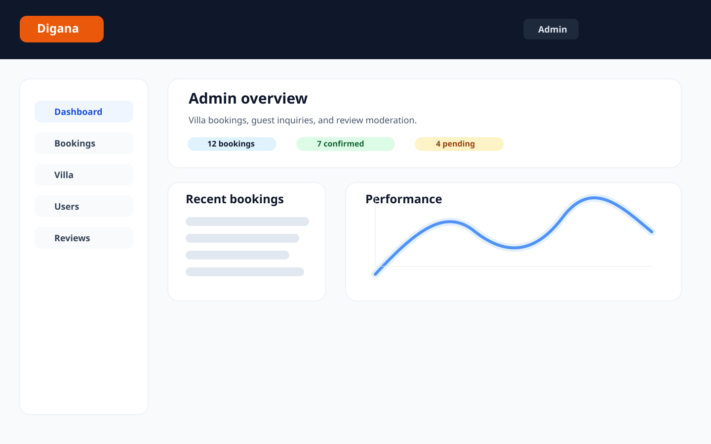

# Digana Villa Website

Repository: https://github.com/chamikarab/Digana-villa-website

Digana Villa is a small villa rental and admin management web app for a single property in Digana, Kandy, Sri Lanka. The public side lets guests request a booking, while the admin portal lets the owner manage bookings, villa details, guest accounts, and review moderation.

## What it does

- Public landing page and booking request form for the villa
- Admin login area for managing the property and guest requests
- Dashboard for villa status, recent bookings, and summary metrics
- Booking management: view, update status, and remove entries
- User management: add, filter, promote, and remove user records
- Review moderation: approve, flag, and update review entries
- Local JSON-backed persistence for a simple file-based app without a database service

## Stack

- Frontend: React + Vite + Tailwind CSS
- Backend: Node.js + Express
- Authentication: JWT sessions with a single environment-configured admin account
- Data persistence: local JSON file store in `backend/data/db.json`
- Current project scope: this repo does not include a live MongoDB instance or a working Stripe payment flow; the Mongo and Stripe integration files are placeholders/stubs only.

## Important implementation notes

- The app currently stores records in `backend/data/db.json` rather than in MongoDB.
- Payment integration files are present as stubs and are not active checkout logic.
- The admin login is intentionally controlled by environment variables in the backend for a single admin account.
- The update endpoints now restrict payloads to an approved allowlist to prevent mass-assignment of unexpected fields.

## Screenshot



## Local setup

### Prerequisites

- Node.js 18+
- npm

### 1. Install dependencies

```bash
cd backend
npm install

cd ../frontend
npm install
```

### 2. Configure environment variables

Create a `backend/.env` file (do not commit it) based on the project defaults:

```env
PORT=5000
JWT_SECRET=change-this-to-a-strong-random-string
ADMIN_EMAIL=admin@diganavilla.com
ADMIN_PASSWORD=Admin@1234
```

The app also supports `ADMIN_PASSWORD_HASH` and `CORS_ORIGIN` in production-oriented setups. See `backend/.env.example` for the full list.

### 3. Start the backend

```bash
cd backend
npm run dev
```

The API runs on `http://localhost:5000`.

### 4. Start the frontend

```bash
cd frontend
npm run dev -- --host 0.0.0.0
```

The site runs on `http://localhost:5173` by default.

## Default admin login

- Email: `admin@diganavilla.com`
- Password: `Admin@1234`

Use these for the local admin portal while developing.

## Project structure

```text
backend/
  data/db.json
  src/
    config/
    controllers/
    db/
    middleware/
    models/
    routes/
    services/
    utils/
  server.js

frontend/
  src/
  public/
  index.html
  vite.config.js
```

## License

This project is for local/demo use in the current workspace and is not published as a production SaaS product.
